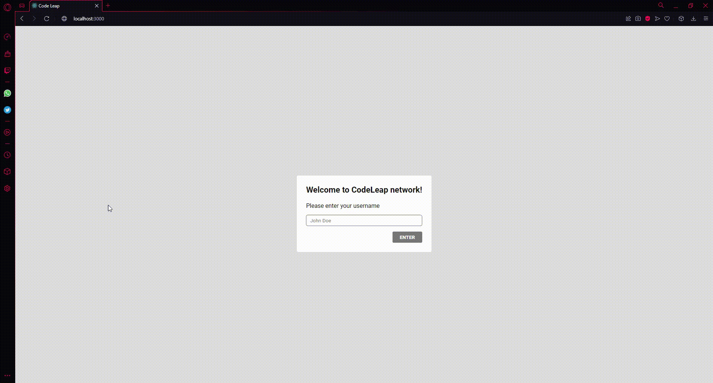

<h1 align="center">
    
</h1>

# Codeleap Social Media

The objective of the application is simulate a real social media where you login to an account and can create, edit and delete your own posts. You can also see all posts of other people when logged.

<h1 align="center">
    
</h1>

# What i used?:

<ul>
<li>React</li>
<li>React Router Dom</li>
<li>React Hooks</li>
<li>Styled Components</li>
<li>Redux</li>
<li>Axios</li>
</ul>


# Demo 📸

<div align="center" >
  
</div>

# Prerequisites

Have this tools installed on your machine : Git, Node.js e Yarn ou Npm.

# Running the app

1.Clone the project

```bash
# Execute this command using git bash
$ git clone https://github.com/Thialves02/codeleap
```

2.Join inside the cloned folder and run the command below

```bash
# Install dependencies
$ yarn install
$ npm install
```

3.Run the application
```bash
#Open the application in your browser
$ yarn start
$ npm start
```
